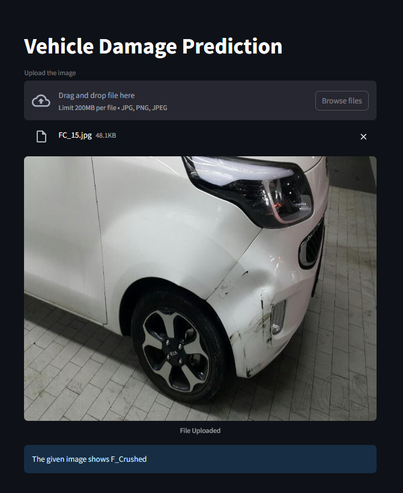

# 🚗 Car Damage Classification

## 1) Project Description

This project is a deep learning-based image classification system that predicts the type of damage in car images. It is designed to distinguish between front and rear damages and categorize the condition as normal, crushed, or broken.

You can upload an image of a damaged car (either front or rear view), and the model will classify it into one of the six predefined damage classes.

---





## 2) About the Model

- **Architecture:** ResNet50 (Pretrained on ImageNet, fine-tuned on custom dataset)
- **Classes:**
  - `F_Breakage`: Front view with breakage
  - `F_Crushed`: Front view with crushed damage
  - `F_Normal`: Front view with no visible damage
  - `R_Breakage`: Rear view with breakage
  - `R_Crushed`: Rear view with crushed damage
  - `R_Normal`: Rear view with no visible damage
- **Validation Accuracy:** 80%

The model was trained on a dataset of **1,700 car images**. The data included a mix of front and rear views. After training, the ResNet50 model achieved **80% accuracy** on the validation set, making it suitable for early-stage testing and prototyping applications in car damage detection.

---

## 3) Setup

### Requirements

1. To get started, make sure you have Python 3.7+ installed. Then install all dependencies using:

   ```bash
   pip install -r requirements.txt
   ```

1. Run the streamlit app:

   ```bash
   streamlit run app.py
   ```